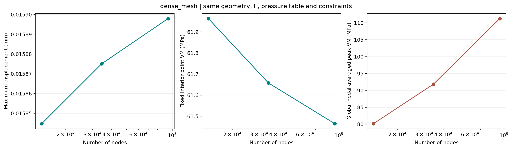
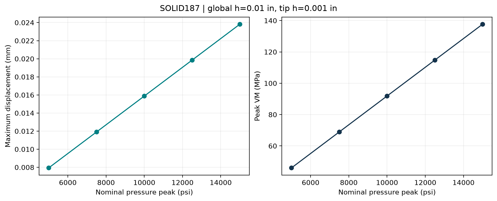
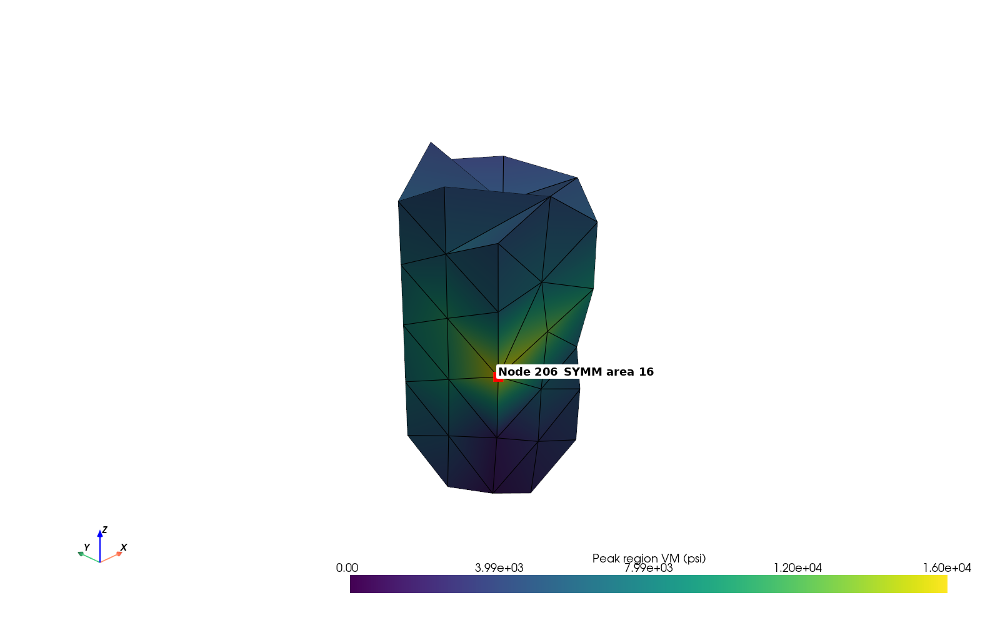

# Lathe Cutter · PyMAPDL 有限元复现与验证

基于 ANSYS 官方车刀案例，建立可参数化、可追溯的结构分析流程，研究网格、单元、压力离散和材料参数对结果的影响，并提供独立的热—结构教学示例。

**English abstract:** Reproduction and extension of the official ANSYS PyMAPDL Lathe Cutter example, with parameterized runs, mesh and load studies, nodal exports, a force-resultant audit, and a separate thermal–structural teaching model. Published evidence contains 48 solved structural cases and 165 figures. Global peak stress remains unconverged.



## 解决的问题与实现的功能

官方脚本展示从几何导入到应力绘图的基本流程。本项目在该流程上补充以下能力：

| 问题 | 实现 | 可检查的证据 |
|---|---|---|
| 图像难以追溯到输入和数值 | 导出输入摘要、节点 CSV、VTU、求解日志；按节点编号映射结果 | `evidence/cases/`，四个完整快照 |
| 一张云图不足以判断网格可靠性 | 局部/整体网格与 SOLID285/187 研究，固定物理位置提取 | `evidence/studies/`，网格研究图 |
| 压力表和模量影响不清楚 | 10/21/41/81 点压力表、压力扫描、模量扫描、3×3 DOE | `plans/`，47 行汇总 CSV |
| 压力与支反力缺少交叉检查 | 四节点四面体边界面独立积分，与全局反力比较 | `force_audit.py`，线性与几何非线性结果 |
| 批量计算和恢复容易混淆输入 | JSON 计划验证、独立运行目录、求解状态检查、相同计划续跑 | `execute_advanced.py`，离线测试 |
| 难以展示温度到结构载荷的传递 | SI 长方体稳态导热→热膨胀，并核对解析温度 | `thermal_demo.py`，热结构证据 |

## 已完成的结果

历史计算环境：Python 3.12.14、PyMAPDL 0.74.1、MAPDL 26.1 Academic Student，SMP / 2 核。48 个结构算例包括 1 个官方基线一致性复算和 47 个扩展算例；另有 1 个热结构流程。全部保留 165 张 PNG、27 页中文报告及研究数据。详见 [来源记录](evidence/PROVENANCE.json) 和 [数值汇总](evidence/metrics.json)。

| 指标 | 实际结果 | 解释 |
|---|---:|---|
| 官方设置复现最大位移 | 0.000527572232 in / 0.013400335 mm | SOLID285，1248 节点，4863 单元 |
| 工作设置最大位移 | 0.015875084 mm | SOLID187，全局 0.01 in，局部 0.001 in，81 点压力表 |
| 最细参考网格最大位移 | 0.015897951 mm | 93841 节点，63171 单元；全局 0.007 in，局部 0.0007 in |
| 81 点表细网格最后两次位移变化 | 0.1910%、0.1438% | 固定位置 VM 变化 0.4953%、0.3141% |
| 相应全局峰值 VM 变化 | 12.73%、17.45% | **峰值应力未收敛** |
| 线性 SOLID285 力合量相对残差 | 3.33×10⁻¹³ | 只检查力合量，未检查力矩 |
| 独立热模型解析温度最大误差 | 7.25×10⁻¹³ °C | 线性温度分布；不是实际刀具热模型 |

压力与位移接近线性，模量与位移接近反比。DOE 拟合用于展示参数规律，尚未进行独立样本验证或优化。峰值位置落在 SYMM 边界区域，仍需研究边界和局部建模，当前证据不能单独证明数学奇异性。




## 快速开始：先验证已有结果

不需要 ANSYS，也不需要安装 Python 第三方依赖。在仓库根目录运行 Python 3.12：

```powershell
python verify_evidence.py
python -m unittest discover -s tests -v
python execute_advanced.py results/campaigns/review plan plans/full_campaign.json --plan-only
```

这些命令验证文件完整性、47 行结果与摘要一致性、四个快照的节点最大值、165 张图片、力残差、细网格指标以及计算计划；不重新求解。GitHub Actions 使用相同离线检查，上传后才会产生远端运行记录。

## 重新计算：连接自己的 MAPDL

在 Windows PowerShell 的仓库根目录：

```powershell
py -3.12 -m venv .venv
.\.venv\Scripts\python.exe -m pip install -r requirements.txt
# 后续命令均使用本仓库的虚拟环境，不要求激活脚本。
$env:PYMAPDL_MAPDL_EXEC = Read-Host '输入你的 MAPDL exe 完整路径'
$env:PYMAPDL_NPROC = '2'
.\.venv\Scripts\python.exe src/baseline.py
.\.venv\Scripts\python.exe src/baseline_advanced.py --case working --element 187 --global-size 0.01 --tip-size 0.001 --load-points 81
```

如本机已有 PyMAPDL 可发现的安装，可不设置 `PYMAPDL_MAPDL_EXEC`。`.env.example` 仅为变量说明，不会自动读取。求解需要自己的 ANSYS 安装及适用许可；仓库不包含 ANSYS 程序。

先验证全量计划，再执行；一次完整执行包含 48 个结构算例：

```powershell
.\.venv\Scripts\python.exe execute_advanced.py results/campaigns/my_campaign plan plans/full_campaign.json --plan-only
.\.venv\Scripts\python.exe execute_advanced.py results/campaigns/my_campaign plan plans/full_campaign.json
.\.venv\Scripts\python.exe thermal_demo.py
```

输出写入 `results/`，不会覆盖已发布的 `evidence/`。相同命令续跑时检查已有成功摘要与输入；更改计划或绘图选项时使用新 campaign 名称。细网格和渲染耗时取决于硬件、安装、许可与图形环境；可用 `--no-plots` 只计算并导出数据。

计算计划同时记录几何和建模脚本 SHA256；修改这些文件后需使用新 campaign，避免混合不同模型的结果。

## 从已有快照做后处理

以下命令需要 `requirements.txt` 中的第三方依赖，不需要求解器：

```powershell
.\.venv\Scripts\python.exe probe_study.py evidence/snapshots.csv --output-dir results/probes/snapshots
.\.venv\Scripts\python.exe analyze_study.py evidence/studies/load/study_results.csv --x nominal_pressure_peak_psi --group element --output-dir results/analysis/load
.\.venv\Scripts\python.exe force_audit.py evidence/cases/advanced_20261008_linear_verification_baseline_linear --output results/audits/linear.json
```

公开仓库提供四个完整结构快照，其余算例提供摘要、研究数据和全部图像；原始全量节点数据及 MAPDL DB/RST 留在本地完整归档。`evidence/all_cases.csv` 标注快照可用性，不能对没有 VTU 的行直接运行固定点提取。

## 阅读顺序与求职展示

1. [方法、假设和判据](docs/METHODS.md)：了解模型、单位、约束和结果的适用范围。
2. [复现与进阶操作](docs/REPRODUCE.md)：从基线到验证、边界研究和真实工况扩展。
3. [中文项目报告（PDF）](docs/project-report-cn.pdf)：27 页历史执行报告，包含完整结果和图像。
4. [全部图片索引](docs/gallery.html)：

历史 PDF 记录了原执行环境的路径和命令；本仓库的可移植执行方式以本 README 为准。整理版脚本已做离线验证与后处理核对，未在每一种安装环境重新执行 48 个算例。

## 来源、许可与贡献

基础模型来自 [ANSYS 官方脚本](https://github.com/ansys/pymapdl/blob/main/examples/00-mapdl-examples/lathe_cutter.py)，几何来自 [ANSYS example-data](https://github.com/ansys/example-data/blob/master/geometry/LatheCutter.anf)。本仓库采用 MIT，原版权与许可保留在 [third_party](third_party/)；详见 [NOTICE](NOTICE.md)。

项目包含工具辅助编程与文档整理。求职时请按实际参与程度说明建模理解、计算运行、验证分析与代码贡献；不要把官方几何描述为个人原创，也不要把未完成的工业验证描述为已通过。可展示的核心能力是：**有限元建模理解、Python 自动化、证据追溯与工程结果判断**。
